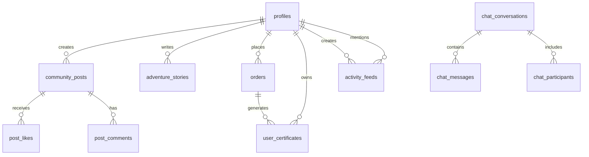

# Database Schema Documentation

## Table Relationships Overview



## Core Tables

### User Management
```sql
-- User profiles (extends Supabase auth.users)
CREATE TABLE profiles (
  id uuid PRIMARY KEY DEFAULT gen_random_uuid(),
  user_id uuid NOT NULL REFERENCES auth.users(id) ON DELETE CASCADE,
  username text NOT NULL UNIQUE,
  full_name text,
  avatar_url text,
  bio text,
  created_at timestamptz DEFAULT now(),
  updated_at timestamptz DEFAULT now()
);

-- User roles for authorization
CREATE TABLE user_roles (
  id uuid PRIMARY KEY DEFAULT gen_random_uuid(),
  user_id uuid NOT NULL REFERENCES auth.users(id) ON DELETE CASCADE,
  role text NOT NULL CHECK (role IN ('admin', 'moderator', 'user')),
  created_at timestamptz DEFAULT now(),
  UNIQUE(user_id, role)
);
```

### Product System
```sql
-- Individual products (animals)
CREATE TABLE products (
  id uuid PRIMARY KEY DEFAULT gen_random_uuid(),
  name text NOT NULL,
  category text NOT NULL CHECK (category IN ('terrestrial', 'marine', 'aerial', 'reptile', 'insect')),
  price numeric NOT NULL,
  description text,
  danger_level integer CHECK (danger_level BETWEEN 1 AND 5),
  rarity text CHECK (rarity IN ('common', 'uncommon', 'rare', 'legendary', 'mythic')),
  locations text[],
  facts text[],
  image_url text,
  is_active boolean DEFAULT true,
  created_at timestamptz DEFAULT now(),
  updated_at timestamptz DEFAULT now()
);

-- Bundle products
CREATE TABLE bundle_products (
  id uuid PRIMARY KEY DEFAULT gen_random_uuid(),
  name text NOT NULL,
  description text,
  category text,
  animal_count integer NOT NULL,
  base_price numeric NOT NULL,
  savings numeric NOT NULL,
  features text[],
  icon text,
  image_url text,
  is_active boolean DEFAULT true,
  created_at timestamptz DEFAULT now()
);

-- Wholesale pricing tiers
CREATE TABLE wholesale_tiers (
  id uuid PRIMARY KEY DEFAULT gen_random_uuid(),
  tier_name text NOT NULL,
  min_quantity integer NOT NULL,
  price_per_unit numeric NOT NULL,
  discount_percentage integer NOT NULL,
  features text[],
  is_active boolean DEFAULT true,
  created_at timestamptz DEFAULT now()
);
```

### Order Management
```sql
-- Customer orders
CREATE TABLE orders (
  id uuid PRIMARY KEY DEFAULT gen_random_uuid(),
  user_id uuid REFERENCES auth.users(id),
  customer_email text NOT NULL,
  customer_name text NOT NULL,
  plan_id text NOT NULL,
  plan_name text NOT NULL,
  amount integer NOT NULL, -- Amount in cents
  currency text NOT NULL DEFAULT 'usd',
  is_bundle boolean NOT NULL DEFAULT false,
  items jsonb,
  status text NOT NULL DEFAULT 'pending' CHECK (status IN ('pending', 'completed', 'failed', 'refunded')),
  stripe_session_id text,
  stripe_payment_intent_id text,
  created_at timestamptz DEFAULT now(),
  updated_at timestamptz DEFAULT now()
);

-- Generated certificates
CREATE TABLE user_certificates (
  id uuid PRIMARY KEY DEFAULT gen_random_uuid(),
  user_id uuid REFERENCES auth.users(id),
  order_id uuid REFERENCES orders(id),
  certificate_type text NOT NULL,
  certificate_name text NOT NULL,
  certificate_data jsonb NOT NULL,
  download_count integer DEFAULT 0,
  created_at timestamptz DEFAULT now(),
  last_downloaded_at timestamptz
);
```

### Community Features
```sql
-- Community posts
CREATE TABLE community_posts (
  id uuid PRIMARY KEY DEFAULT gen_random_uuid(),
  user_id uuid NOT NULL REFERENCES auth.users(id) ON DELETE CASCADE,
  content text NOT NULL,
  image_url text,
  location text,
  certificate_id uuid REFERENCES user_certificates(id),
  likes_count integer DEFAULT 0,
  comments_count integer DEFAULT 0,
  shares_count integer DEFAULT 0,
  created_at timestamptz DEFAULT now(),
  updated_at timestamptz DEFAULT now()
);

-- Adventure stories (featured content)
CREATE TABLE adventure_stories (
  id uuid PRIMARY KEY DEFAULT gen_random_uuid(),
  user_id uuid NOT NULL REFERENCES auth.users(id) ON DELETE CASCADE,
  title text NOT NULL,
  content text NOT NULL,
  predator_type text,
  location text,
  image_urls jsonb DEFAULT '[]'::jsonb,
  certificate_id uuid REFERENCES user_certificates(id),
  shares_count integer DEFAULT 0,
  views_count integer DEFAULT 0,
  likes_count integer DEFAULT 0,
  is_featured boolean DEFAULT false,
  created_at timestamptz DEFAULT now(),
  updated_at timestamptz DEFAULT now()
);

-- Post interactions
CREATE TABLE post_likes (
  id uuid PRIMARY KEY DEFAULT gen_random_uuid(),
  post_id uuid NOT NULL REFERENCES community_posts(id) ON DELETE CASCADE,
  user_id uuid NOT NULL REFERENCES auth.users(id) ON DELETE CASCADE,
  created_at timestamptz DEFAULT now(),
  UNIQUE(post_id, user_id)
);

CREATE TABLE post_comments (
  id uuid PRIMARY KEY DEFAULT gen_random_uuid(),
  post_id uuid NOT NULL REFERENCES community_posts(id) ON DELETE CASCADE,
  user_id uuid NOT NULL REFERENCES auth.users(id) ON DELETE CASCADE,
  parent_comment_id uuid REFERENCES post_comments(id),
  content text NOT NULL,
  likes_count integer DEFAULT 0,
  created_at timestamptz DEFAULT now(),
  updated_at timestamptz DEFAULT now()
);
```

### Real-time Chat System
```sql
-- Chat conversations
CREATE TABLE chat_conversations (
  id uuid PRIMARY KEY DEFAULT gen_random_uuid(),
  name text,
  is_group boolean NOT NULL DEFAULT false,
  created_by uuid REFERENCES auth.users(id),
  created_at timestamptz DEFAULT now(),
  updated_at timestamptz DEFAULT now()
);

-- Chat participants
CREATE TABLE chat_participants (
  id uuid PRIMARY KEY DEFAULT gen_random_uuid(),
  conversation_id uuid NOT NULL REFERENCES chat_conversations(id) ON DELETE CASCADE,
  user_id uuid NOT NULL REFERENCES auth.users(id) ON DELETE CASCADE,
  joined_at timestamptz DEFAULT now(),
  last_read_at timestamptz DEFAULT now(),
  UNIQUE(conversation_id, user_id)
);

-- Chat messages
CREATE TABLE chat_messages (
  id uuid PRIMARY KEY DEFAULT gen_random_uuid(),
  conversation_id uuid NOT NULL REFERENCES chat_conversations(id) ON DELETE CASCADE,
  sender_id uuid NOT NULL REFERENCES auth.users(id) ON DELETE CASCADE,
  content text NOT NULL,
  message_type text NOT NULL DEFAULT 'text' CHECK (message_type IN ('text', 'image', 'file')),
  reply_to_id uuid REFERENCES chat_messages(id),
  is_edited boolean DEFAULT false,
  created_at timestamptz DEFAULT now(),
  updated_at timestamptz DEFAULT now()
);
```

### Activity & Analytics
```sql
-- Activity feed for real-time updates
CREATE TABLE activity_feeds (
  id uuid PRIMARY KEY DEFAULT gen_random_uuid(),
  user_id uuid NOT NULL REFERENCES auth.users(id) ON DELETE CASCADE,
  activity_type text NOT NULL,
  target_id uuid,
  target_type text,
  metadata jsonb DEFAULT '{}'::jsonb,
  created_at timestamptz DEFAULT now()
);

-- Site audit results
CREATE TABLE site_audits (
  id uuid PRIMARY KEY DEFAULT gen_random_uuid(),
  domain text NOT NULL,
  url text NOT NULL,
  audit_type text NOT NULL DEFAULT 'full',
  status text NOT NULL DEFAULT 'pending' CHECK (status IN ('pending', 'running', 'completed', 'failed')),
  results jsonb,
  summary jsonb,
  total_pages integer DEFAULT 0,
  total_errors integer DEFAULT 0,
  average_load_time integer DEFAULT 0,
  seo_score integer DEFAULT 0,
  accessibility_score integer DEFAULT 0,
  performance_score integer DEFAULT 0,
  created_by uuid REFERENCES auth.users(id),
  created_at timestamptz DEFAULT now(),
  completed_at timestamptz
);
```

## Row Level Security (RLS) Policies

### User Data Access
```sql
-- Users can only access their own profile data
ALTER TABLE profiles ENABLE ROW LEVEL SECURITY;
CREATE POLICY "Users can view their own profile" ON profiles
  FOR SELECT USING (auth.uid() = user_id);
CREATE POLICY "Users can update their own profile" ON profiles
  FOR UPDATE USING (auth.uid() = user_id);

-- Users can only access their own orders
ALTER TABLE orders ENABLE ROW LEVEL SECURITY;
CREATE POLICY "Users can view their own orders" ON orders
  FOR SELECT USING (auth.uid() = user_id);

-- Users can only access their own certificates
ALTER TABLE user_certificates ENABLE ROW LEVEL SECURITY;
CREATE POLICY "Users can view their own certificates" ON user_certificates
  FOR SELECT USING (auth.uid() = user_id);
```

### Community Content Access
```sql
-- Public read access for community posts
ALTER TABLE community_posts ENABLE ROW LEVEL SECURITY;
CREATE POLICY "Anyone can view community posts" ON community_posts
  FOR SELECT USING (true);
CREATE POLICY "Authenticated users can create posts" ON community_posts
  FOR INSERT WITH CHECK (auth.uid() = user_id);
CREATE POLICY "Users can update their own posts" ON community_posts
  FOR UPDATE USING (auth.uid() = user_id);

-- Similar policies for adventure stories
ALTER TABLE adventure_stories ENABLE ROW LEVEL SECURITY;
CREATE POLICY "Anyone can view adventure stories" ON adventure_stories
  FOR SELECT USING (true);
CREATE POLICY "Authenticated users can create stories" ON adventure_stories
  FOR INSERT WITH CHECK (auth.uid() = user_id);
```

### Chat System Access
```sql
-- Users can only access conversations they participate in
ALTER TABLE chat_conversations ENABLE ROW LEVEL SECURITY;
CREATE POLICY "Participants can view conversations" ON chat_conversations
  FOR SELECT USING (
    id IN (
      SELECT conversation_id FROM chat_participants 
      WHERE user_id = auth.uid()
    )
  );

-- Users can only see messages from their conversations
ALTER TABLE chat_messages ENABLE ROW LEVEL SECURITY;
CREATE POLICY "Participants can view messages" ON chat_messages
  FOR SELECT USING (
    conversation_id IN (
      SELECT conversation_id FROM chat_participants 
      WHERE user_id = auth.uid()
    )
  );
```

## Database Functions

### Utility Functions
```sql
-- Handle new user registration
CREATE OR REPLACE FUNCTION handle_new_user()
RETURNS TRIGGER AS $$
BEGIN
  INSERT INTO public.profiles (user_id, username, full_name)
  VALUES (
    NEW.id, 
    COALESCE(NEW.raw_user_meta_data->>'username', 'user_' || substring(NEW.id::text, 1, 8)),
    COALESCE(NEW.raw_user_meta_data->>'full_name', '')
  );
  RETURN NEW;
END;
$$ LANGUAGE plpgsql SECURITY DEFINER;

-- Trigger to automatically create profile on user signup
CREATE TRIGGER on_auth_user_created
  AFTER INSERT ON auth.users
  FOR EACH ROW EXECUTE FUNCTION handle_new_user();
```

### Analytics Functions
```sql
-- Update trending scores for content
CREATE OR REPLACE FUNCTION update_trending_scores()
RETURNS void AS $$
BEGIN
  UPDATE community_posts 
  SET trending_score = (
    (likes_count * 1.0) + 
    (comments_count * 2.0) + 
    (shares_count * 3.0)
  ) / POWER(EXTRACT(EPOCH FROM (now() - created_at)) / 3600 + 1, 1.5)
  WHERE created_at > now() - INTERVAL '7 days';
END;
$$ LANGUAGE plpgsql;
```

## Indexes for Performance

```sql
-- User-related indexes
CREATE INDEX idx_profiles_user_id ON profiles(user_id);
CREATE INDEX idx_profiles_username ON profiles(username);

-- Content indexes
CREATE INDEX idx_community_posts_user_id ON community_posts(user_id);
CREATE INDEX idx_community_posts_created_at ON community_posts(created_at DESC);
CREATE INDEX idx_adventure_stories_user_id ON adventure_stories(user_id);
CREATE INDEX idx_adventure_stories_featured ON adventure_stories(is_featured, created_at DESC);

-- Chat indexes
CREATE INDEX idx_chat_messages_conversation_id ON chat_messages(conversation_id, created_at);
CREATE INDEX idx_chat_participants_user_id ON chat_participants(user_id);

-- Activity feed indexes
CREATE INDEX idx_activity_feeds_user_id ON activity_feeds(user_id);
CREATE INDEX idx_activity_feeds_created_at ON activity_feeds(created_at DESC);

-- Order indexes
CREATE INDEX idx_orders_user_id ON orders(user_id);
CREATE INDEX idx_orders_status ON orders(status);
CREATE INDEX idx_orders_created_at ON orders(created_at DESC);
```

This schema supports a full-featured social platform with e-commerce, real-time chat, and comprehensive analytics while maintaining security through Row Level Security policies.
